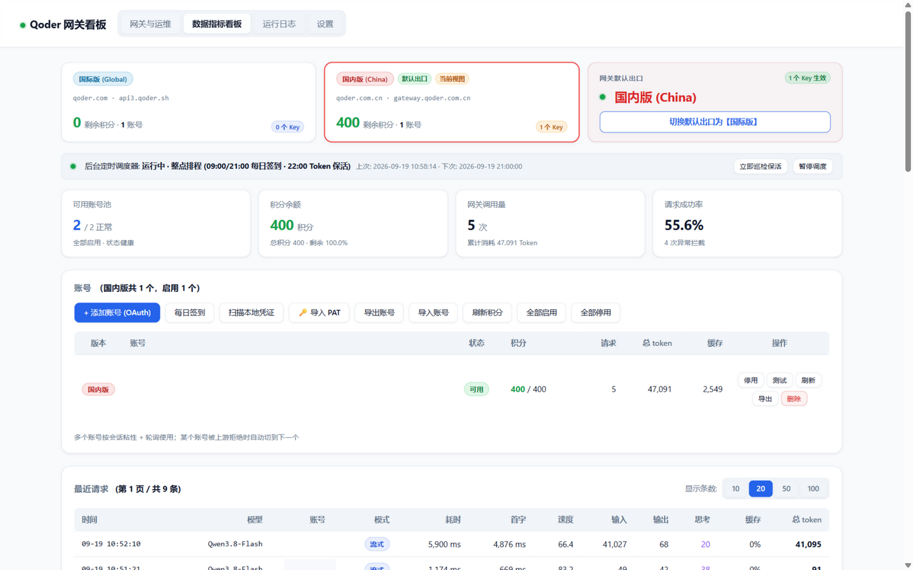
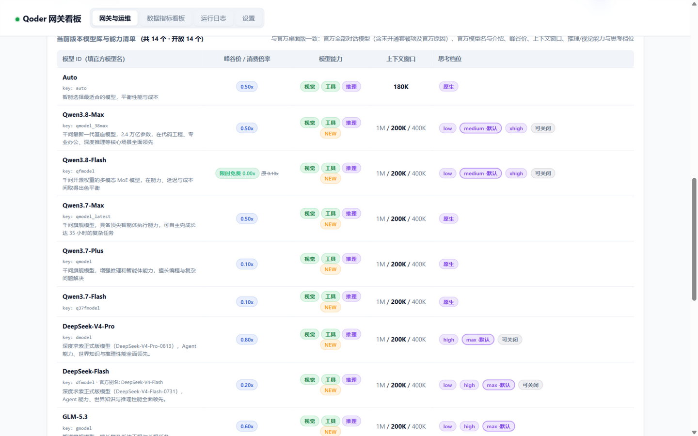
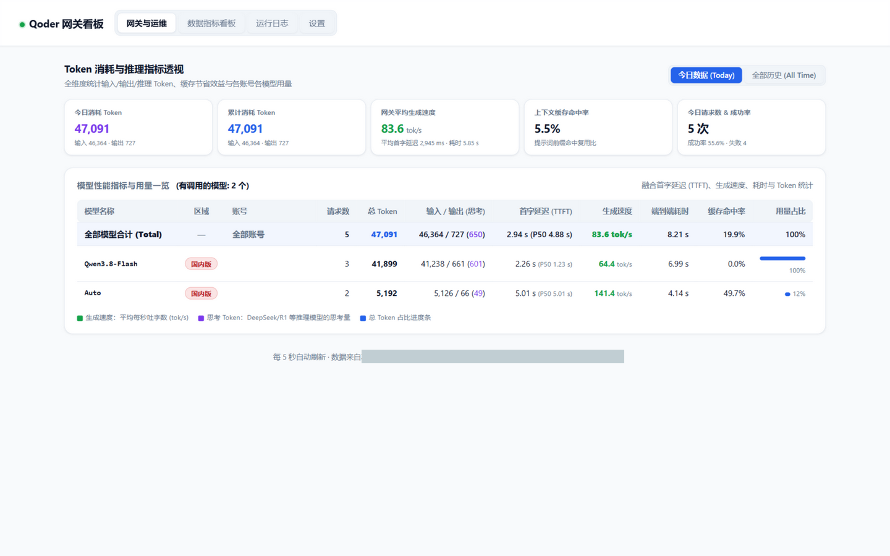
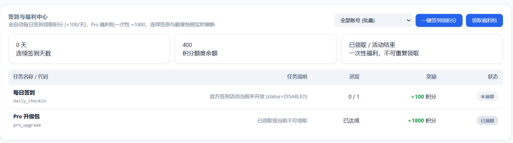

# Qoder2API-Hub — 国际版、国内版多账号网关中枢

<p align="center">
  
  
  
  
  
  
</p>

本项目为 **Qoder2API-Hub**，将阿里 **[qoder.com.cn](https://qoder.com.cn)** (国内版) 与 **[qoder.com](https://qoder.com)** (国际版) 的原生服务封装为标准 OpenAI 兼容接口，支持 Chat Completions 与 Responses API。具备多账号负载轮询、稳定物理设备指纹隔离、OAuth 设备授权一键免客户端登录、每日签到与实时额度查询、Pro 福利包自动领取、后台常驻定时调度器、Web 监控看板等全套能力 —— 与 WorkBuddy2API-Hub 同构的完整功能矩阵。

- **开箱即用**：双击批处理脚本即启；亦支持 Docker 容器化部署，零外部 pip 依赖。
- **本机已登录凭证一键入池（双区）**：只读探测桌面 App（`auth.v1.dat`，os_crypt/DPAPI 解密）与 Qoder CLI（`~/.qoder*/.auth/user`，AES-128-CBC）两类官方存储，看板两步确认导入，永不静默采用。
- **模型清单完全跟官方走（双区不同、以官方此刻为准）**：三源优先级 —— 动态 `/algo/api/v2/model/list`（COSY 签名，**GET 需携带与签名一致的 `{}` body，否则 403**）> 本机官方客户端模型目录缓存（`~/.qoder*/.models/<uid>/catalog-v6`，QMC/HKDF+AES-256-GCM 解密）> 内嵌双区官方快照；清单**以动态源返回的集合为准**（官方桌面版此刻显示什么这里就显示什么，如国际版动态 15 条就不多塞静态独有的 `smodel/cmodel`）。**逐字段忠实保留**：`id` = **官方模型名**（如 `Qwen3.8-Max`，客户端唯一需要填的值；`upstream_key`/`aliases` 同时给出 key、`key (Name)` 与人类别名等全部可填形式）、官方桌面版介绍文案（`description`，取自客户端 dynamic-text）、本地化名（`name_local`，如 Ultimate→极致）、`context_config` 多窗口（200K 默认/400K/1M）、`thinking_config` 思考档位（low/medium/high/xhigh/max + 默认标注 + 可关闭）、**峰谷价**（`price_factor_peak` 促销前倍率 → `price_factor_valley` 谷时倍率 + `off_peak` 时段窗口 22:00-08:00 与官方错峰文案）、`is_free/is_new`；官方 `enable=false` 条目不过滤，附**官方原文禁用原因**（`disabled_reason = "需要升级或购买千问官方套餐开放"`，并透传上游 `disabled_message_key`）。**最大输出**：官方 catalog 与动态接口原始响应均无此字段，故不再输出/展示任何编造值。
- **双区域独立路由**：支持 🌐 国际版 (qoder.com / api3.qoder.sh) 与 🇨🇳 国内版 (qoder.com.cn / gateway.qoder.com.cn) 独立配置与管理，区域独占模型（如国内 `q37fmodel`/`glm-5.2`、国际 `smodel`/`ultimate`）自动路由到归属出口并拦截错配 Key，看板一键切换且状态落盘持久化。
- **COSY 签名推理链路**：RSA 包裹 AES 会话密钥 + MD5 请求签名 + 自定义 Base64 请求体编码，纯标准库实现（含 AES-128/256、RSA-PKCS1v15、GCM、DPAPI、QMC 纯 Python 实现，Docker alpine 下同样零依赖），逆向对齐官方桌面/CLI 客户端协议。
- **稳定物理设备指纹隔离 (`derive_id`)**：以账号自身 UID 稳定哈希派生专属 `cosy-machineid` / `cosy-machinetoken` / 会话标识，同一账号长期固定在同一台虚拟物理设备，天然防多号关联风控。
- **OAuth 设备授权一键免客户端登录**：PKCE (S256) 设备流（双区 URL 参数按官方差异构造：国内带 `redirect_uri+client_id+machine_id`，国际带 `client_id+machine_id`），点击看板链接在浏览器完成授权即可自动入池；亦支持 PAT (`pt-`) 导入，jobToken 自动交换与轮换。
- **每日签到与额度体系（官方能力门控）**：签到/Pro 福利活动**仅国内版提供**（国际版官方无签到接口）；国内版每日签到（活动 `DISABLED` 时诚实跳过不硬领）、连续签到统计、Pro 升级包资格检查与领取、quota/usage 额度与套餐快照实时刷新。
- **后台常驻定时调度器**：每日整点排程（09:00 / 21:00 签到 · 22:00 Token 集中保活），`drt-` / `jrt-` 按前缀路由刷新，PAT 最终兜底。
- **双协议全功能支持**：同时支持标准 OpenAI Chat Completions 协议与 Responses API (Codex / Claude Code)，含 custom freeform 工具（`apply_patch`）双向转译与 DSML 工具调用回退解析。
- **现代化 Web 看板**：弹性指标卡片、签到与福利中心、模型能力清单、性能指标与用量透视、实时请求流水与运行日志。

> ⚡ 本项目架构与交互对齐 WorkBuddy2API-Hub，上游协议替换为 Qoder COSY 签名体系。

---

## 🖼️ 看板预览 (Dashboard Preview)

**网关总览** —— 双区出口状态、调度器、账号池与请求流水一屏尽览：



**模型清单** —— 与官方桌面版同源：官方模型名、峰谷价、上下文多窗口、思考档位、能力徽标：



**数据指标看板** —— Token 消耗透视、TTFT 首字延迟、生成速度与缓存命中率：



**签到与福利中心** —— 每日签到领积分、Pro 福利包一键领取（仅国内版）：



---

## 一、快速启动

### 1. 本机单机使用
双击运行 **`start-qoder-proxy.bat`**，保持窗口运行：
- **API 接口地址**：`http://127.0.0.1:8790/v1`
- **Web 监控看板**：`http://127.0.0.1:8790/`

> ℹ️ 默认端口 **8790**（8788 被 `mimo-api-proxy.mjs` 占用，8789 为 wb-proxy 默认）。改端口：`start-qoder-proxy.bat 8791`。

首次启动若无账号，直接打开看板点击 **「+ 添加账号 (OAuth)」**，在浏览器完成设备授权即可自动加入；或点 **「🔑 导入 PAT」** 粘贴个人访问令牌。

### 2. 面板访问密码

打开看板需要先输入**面板访问密码**，默认是 `admin`。它与 API Key 相互独立：

- 面板密码只用于打开网页看板，可在看板「设置」页修改（也可启动时 `--panel-password` 指定）；
- 密码以 PBKDF2-SHA256 摘要形式保存在 `accounts/settings.json`，不存明文；
- 登录状态存放在浏览器会话中，关闭浏览器或重启网关后需要重新输入。

> 首次登录后请立即到「设置」修改默认密码。

### 3. 局域网共享模式
双击运行 **`start-qoder-proxy-lan.bat`**，允许局域网内其他设备访问：
- **Base URL**：`http://<本机局域网IP>:8790/v1`
- **密钥随机生成并持久化**：LAN 模式首次启动生成高强度随机 API Key（`qd-` 前缀），保存到 `accounts/settings.json` 并在终端打印，重启复用。
- **自定义 Key**：`start-qoder-proxy-lan.bat 8790 我的Key`
- 支持带密钥直达面板：`http://<IP>:8790/?key=生成的Key`。
- 其他设备连不上时，管理员运行一次 `allow-firewall.bat` 放行防火墙。

### 4. 多 API Key 管理与出口绑定

网关支持**多 API Key 并行管理**，并可为每个 Key 指定独立出口：

- **添加与在线生成**：看板「设置」页，输入名称 + 一键生成随机 Key；
- **出口自由绑定**：
  - 🌐 **国际版出口**：该 Key 流量强制走 `api3.qoder.sh`
  - 🇨🇳 **国内版出口**：该 Key 流量强制走 `gateway.qoder.com.cn`
  - **跟随面板切换**：未绑定出口的 Key 实时跟随看板顶部全局出口
- **状态管理**：单独启停、一键删除，删除即刻失效；配置持久化到 `accounts/settings.json`；
- **安全防冲突**：面板配置过 Key 后，启动脚本里的旧 `--api-key` 自动失效；
- **模型区域自检**：Key 出口与模型区域不匹配时返回通俗 400，杜绝上游晦涩拒流报错。

### 5. Docker 容器化部署

```bash
# 1. 后台启动容器 (自动构建并运行)
docker compose up -d

# 2. 查看网关日志
docker compose logs -f
```

或直接 `docker run`：

```bash
docker run -d --name qoder-proxy --restart unless-stopped \
  -p 8790:8790 -v $(pwd)/accounts:/app/accounts -v $(pwd)/usage:/app/usage \
  -e API_KEY=your_secret_key $(docker build -q .)
```

- **持久化目录**：`./accounts`（账号凭证及出口设置）与 `./usage`（请求流水与指标快照）；
- **配置参数**：环境变量 `API_KEY`、`PORT`。

---

## 二、核心特性详解

### 1. 请求链路（COSY 签名推理）

**瞬时故障韧性（双层）**：上游把自己的 provider 故障包装成 `418/5xx + provider_error` 抛回，或对 `qoder.sh` 出现 TLS/连接抖动（`SSL: UNEXPECTED_EOF...`）时：
- **连接层**（urlopen 时刻的 HTTP/传输错误）：同账号快速重试 2 次（1s/2s 退避）；
- **流内信封层**（关键形态：上游先 HTTP200 建流、再在 SSE 信封里投 `statusCodeValue=418`——表现为 access log 记 200 而业务错 418）：在**尚未向客户端写出任何上游字节**前重开上游重试 2 次（chat 流式/非流式 + Responses 全覆盖），流式客户端全程无感。

重试仍失败才**短冷却（15s，单账号池实际 3s）换号**——不因上游的锅罚账号 60 秒；**短错误冷却期间（≤10s）后续请求改为「等待续上」而非报错**，且 `429 usage exceeds frequency limit` **只在上游真频控时出现**（账号错误冷却不再被误标为频控）。客户端参数错误（`invalid_parameter_error` 等）与**上游内容安全审核拒绝**（`InternalError.Algo.DataInspectionFailed: Input text data may contain inappropriate content`）**绝不重试**、快速失败——后者返回中文解释（`content_policy_rejected`：确定性拒绝、重试无效，请检查/缩短输入），由调用方修改输入而非等待。耗尽后其余瞬时错误客户端收到中文友好提示（`upstream_transient_error`）；错误详情经 `qoder_detail` 挂载保留 400 字节完整送达日志（含内层 `details`）。

```
客户端 OpenAI 请求
  → build_qoder_body()   官方 baseprompt 模板 + 会话压平（system/工具/参数覆写）
  → qoder_encode()       Qoder 自定义 Base64（标准 B64 三段轮转 + 字母表映射, '=' → '$'）
  → COSY 签名            RSA(1024) 包裹 AES-128 会话密钥 → info(AES-CBC 身份)
                         Bearer = COSY.{payloadB64}.{md5(payload\ncosyKey\ndate\nbody\npath)}
  → POST {gateway}/algo/api/v2/service/pro/sse/agent_chat_generation?…&Encode=1
  → SSE 信封解包          {"headers","body","statusCodeValue"} 嵌套帧 → 内层 OpenAI chunk
  → 标准 OpenAI SSE / chat.completion 回给客户端
```

模型清单按**三源优先级**完全对齐官方（详见「核心特性 · 模型清单」）：

```
1) 动态接口  GET {gateway}/algo/api/v2/model/list?Encode=1   （COSY 签名，需账号，300s 缓存）
2) 本机官方客户端目录 ~/.qoder*/.models/<uid>/catalog-v6      （QMC 解密，离线可用）
3) 内嵌双区官方快照 qoder_catalog.py                           （兜底）
```

**双区清单不同**（源自本机官方客户端 catalog 的**全字段**忠实快照，chat 场景；`id` = 官方模型名，直接照抄即可）：

- 🇨🇳 **国内版 (动态 14 条，全部开通)**：`Auto` · `Qwen3.8-Max` · `Qwen3.8-Flash` · `Qwen3.7-Max` · `Qwen3.7-Plus` · `Qwen3.7-Flash` · `DeepSeek-V4-Pro` (96K) · `DeepSeek-Flash` · `GLM-5.3` · `GLM-5.3-Flash` (1M) · `GLM-5.2` · `Kimi-K3` · `Kimi-K2.8-Preview` · `MiniMax-M2.7`
- 🌐 **国际版 (动态 15 条；开通 2、未开通 13)**：`Qwen3.8-Max`、`Qwen3.8-Flash` 开放；其余（`Ultimate`/`Performance`/`Efficient`/`DeepSeek-V4-Pro`/`MiniMax-M3`/`Auto` 等）标注**官方原文**「需要升级或购买千问官方套餐开放」+ 上游 `disabled_message_key`（`codeSafeModelReason`），**不隐藏条目**（与桌面版此刻同一份清单）。

**峰谷价（官方 `promotion` 字段）——低谷折扣模型共 3 个（双区一致），全部高亮**：

| 模型 | 峰价 | 谷价 | 折扣（官方 badge） |
|---|---|---|---|
| `Qwen3.8-Max` (`qmodel_38max`) | 0.50x | 0.20x | 错峰 4 折 |
| `Qwen3.7-Max` (`qmodel_latest`) | 0.50x | 0.10x | 错峰 2 折 |
| `Qwen3.7-Plus` (`qmodel`) | 0.10x | 动态为准（快照 0.04x） | 错峰 4 折 |

均为 22:00-08:00 窗口（`Qwen3.8-Flash` 另有限时免费 0.00x，原 `0.10x`）。`/v1/models` 与看板对**每个**促销模型输出 `price_factor_peak` / `price_factor_valley` / `off_peak{window_start,window_end,badge,description,discount_factor,timezone}` 与 **`off_peak_active_now`**（按官方时区 UTC+8 跨午夜窗口判定当前是否处于低谷）。判定顺序上 **promotion 分支优先于 0 价分支**——`is_free` 表示"含免费权益"而非 0 价（Qwen3.8-Max `is_free=true` 但价 0.20x），不会被错标成免费、也不会吞掉低谷高亮（单测有分支顺序回归断言）。

**低谷时段视觉高亮**：看板在低谷窗口（22:00-08:00）内把价签切换为**亮绿发光高亮块**——大号谷价 +「● 低谷生效中」徽标 + 峰价红色删除线 + 时段/折扣文案；非低谷时段显示常规「峰 x → 谷 x」并提示「低谷自 22:00 起」。判定用后端字段 + 浏览器本地时间即时复算双保险，跨窗口自动切换。

同 key 跨区也可能不同（`mmodel` 国际=MiniMax-M3、国内=MiniMax-M2.7）；上下文窗口、倍率、视觉/推理标志逐项取自官方条目（如国内 `dmodel` 96000、国际 `dmodel` 1000000）。请求侧接受 key / 展示 id「key (Name)」/ 人类可读别名 / 官方显示名任意形式；区域独占模型（国内 `q37fmodel`/`glm-5.2`、国际 `smodel`/`ultimate` 等）自动路由到归属出口。

### 2. 稳定物理设备指纹隔离 (`derive_id`)

双区域统一方案：以账号 UID + 业务盐单向 MD5 派生固定 `machineId` / `sessionId` / `machineType` / `machineToken`，COSY 签名头逐请求携带：

- **同一账号长期稳定**：出站请求永远来自同一台虚拟物理设备，规避机器码漂移风控；
- **多账号天然隔离**：不同账号机器码彼此独立，阻断跨账号关联检测。

### 3. 每日签到、额度与 Pro 福利包（官方能力门控：仅国内版）

- **每日签到**：`GET /sash/api/v1/me/daily-check-in/status` → 未签则 `POST …/claim`（+100 积分）；409 `ALREADY_CLAIMED` 归一化为「今日已签到」；上游活动停用（`status=DISABLED`）时诚实跳过、不硬领；签到后即时刷新额度快照；
- **国际版官方无签到接口**：国际版账号在任务中心、批量签到、调度器中均被自动门控，不会发起无效请求；国际版仍可查询 `quota/usage` 额度与 `user/plan` 套餐；
- **额度体系**：`/api/v2/quota/usage` 聚合基础额度 + 赠送/签到额度；`/api/v2/user/plan` 套餐名（Pro Trial 等）；
- **Pro 福利包**：一次性 +1800 积分，`eligibility → claim` 两步走（端点 404 时视为活动未开放）；
- **看板「签到与福利中心」**：连续签到天数、积分余额、福利包状态卡片 + 任务行表格，支持单账号/批量（仅国内视图显示，与官方能力一致）。

### 4. 后台常驻定时调度器 (Scheduler)

- **每日 09:00 & 21:00**：全量自动签到（补签未签账号）+ 额度快照刷新；
- **每日 22:00**：集中 Token 保活 —— `drt-` → `deviceToken/refresh`，`jrt-` → `jobToken/refresh`，失败回落 PAT 重新交换；
- 任意巡检中对剩余寿命不足 4 小时的 Token 提前刷新；
- **会话死亡识别**：上游 `TOKEN_EXPIRE` / `12153` / `Offline user session not found` → 自动停用账号并标注需重新登录。

### 5. 凭证家族与生命周期

```
accessToken:   dt- (OAuth 设备流, ~30天)  或 jt- (PAT 交换, 24小时)
refreshToken:  drt- (~1年, 旋转)          或 jrt- (48小时)
personalToken: pt- (长期兜底, 看板导入)
```

刷新按 `refreshToken` 前缀路由，PAT 永不覆盖活跃 OAuth 会话，只做最终兜底；`access token` 轮换后 COSY 会话自动重建。

---

## 三、账号添加与管理

打开看板 `http://127.0.0.1:8790/`，在「账号」区域操作：

### 方式零：扫描本机已登录凭证（推荐，双区）
1. 点击 **「扫描本地凭证」**（只读，不写入）；
2. 弹窗分区域列出检测到的凭证：
   - **桌面 App**：`%APPDATA%\com.qoder[.cn].app.stable\auth.v1.dat`
     （Chromium `v10` 布局，`Local State` 的 os_crypt 密钥经 DPAPI 解出后 AES-256-GCM 解密）
   - **Qoder CLI**：`~/.qoder[.cn]/.auth/user[.{profile}]`
     （AES-128-CBC，key = `machine_id` 前 16 字符）
3. 点击对应行的 **「导入」**（或启动时日志只会提示发现 N 条、绝不静默采用）。

### 方式一：OAuth 设备授权（推荐，免客户端）
1. 点击 **「+ 添加账号 (OAuth)」**；
2. 选择登录区域（国内版 / 国际版），点击弹出的官方授权链接；
3. 浏览器完成登录授权（PKCE S256），网关自动轮询取回 `dt-`/`drt-` 并入池。

### 方式二：PAT 导入
1. 在 Qoder 网页版「设置 → Personal Access Token」创建 `pt-` 令牌；
2. 看板点击 **「🔑 导入 PAT」**，选择区域并粘贴；
3. 网关自动交换 `jt-`/`jrt-`、拉取账号身份入池。

### 方式三：JSON 导入 / 导出
- 支持全量/单账号导出（可选带密钥）、Dry-Run 预检导入、覆盖同 UID；
- 兼容本网关导出格式、账号数组、单个账号对象。

---

## 四、客户端配置与接入

### OpenAI 兼容客户端 (Chatbox / NextChat / Cherry Studio / Kelivo 等)
- **API 接口地址 (Base URL)**：`http://127.0.0.1:8790/v1`（局域网为 `http://<局域网IP>:8790/v1`）
- **API Key**：
  - 本机单机模式（未配置 Key 且未开 LAN）：可留空或填任意字符；
  - 已配置 Key 或 LAN 模式：在看板「设置」添加或复制已绑定出口的 Key。
- **模型名称**：填 `/v1/models` 列出的 **`id`（官方模型名，如 `Qwen3.8-Max`）** —— 这是唯一需要记的值；`upstream_key`（缩写 key）、人类别名（`qwen3.8-max`）与官方本地化名也全部可解析。

### Codex CLI / Claude Code (Responses API)
```bash
export OPENAI_BASE_URL="http://127.0.0.1:8790/v1"
export OPENAI_API_KEY="你在看板设置中添加并绑定的API_Key"
```
custom freeform 工具（`apply_patch`）自动降级为 function 工具出站、入站还原为 `custom_tool_call`，Codex 工具回路完整可用。

---

## 五、看板与接口一览

访问 `http://127.0.0.1:8790/` 即可使用集成看板，核心接口：

| 方法 | 路径 | 说明 |
|---|---|---|
| GET | / | Web 用量与任务监控看板 |
| POST | /v1/chat/completions | 标准 Chat Completions 接口 |
| POST | /v1/responses | Responses API 协议接口 |
| GET | /v1/models | 模型列表（动态拉取 + 静态兜底，含能力与规格宣告） |
| GET | /tasks | 签到状态、连续天数、福利包资格与额度快照 |
| POST | /tasks/run | 触发批量每日签到与领奖 |
| POST | /tasks/travel | 批量领取 Pro 福利包 |
| GET | /scheduler | 定时调度器运行状态与排程日志 |
| POST | /scheduler/trigger | 手动立即执行后台巡检保活 |
| POST | /accounts/login/start | 发起 OAuth 设备授权 |
| POST | /accounts/import/pat | 导入 PAT 令牌 |
| POST | /accounts/checkin | 手动签到（单个/全部） |

---

## 六、开发与测试

```bash
# 离线确定性测试（209 项断言：AES-128/256 向量与官方 fixture KAT、QMC/凭证解密、
# 自定义 B64、COSY 签名、双区官方目录全字段（峰谷价/多窗口/思考档位/展示 id/解析）、
# 独占路由、签到能力门控与 DISABLED 归一化、请求体、信封解包、custom 工具转译、
# 本机凭证扫描）
python _test_qoder.py

# 直接启动
python qoder_proxy.py --port 8790

# 端到端模型库/能力清单验证（网关运行中执行；逐模型对比官方"此刻"数据：
# id/enable/峰谷价/上下文窗口/思考档位/官方介绍/禁用原因/不编造字段/低谷判定）
#   基准 = 官方动态接口优先（与桌面版选择器同源），本机目录按字段兜底
python _verify_models.py --base http://127.0.0.1:8790
#   313 项断言；退出码 0=全部一致；1=存在差异（打印逐条 FAIL 明细）；2=网关不可达
```

模块结构：

| 文件 | 职责 |
|---|---|
| `qoder_proxy.py` | 主网关：HTTP 路由、COSY 数据面、双协议转换、用量统计、看板鉴权 |
| `qoder_sign.py` | 自定义 Base64、纯库 AES-128/256 + GCM、RSA、DPAPI、QMC 解密、COSY 签名 |
| `qoder_accounts.py` | 双区账号池、OAuth 设备流、PAT、Token 生命周期、**本机凭证扫描/导入** |
| `qoder_catalog.py` | 双区官方模型快照（源自本机解密的官方 catalog）、别名与独占表 |
| `qoder_tasks.py` | 签到闭环（含 DISABLED 归一化）、Pro 福利包、批量执行、保活巡检 |
| `qoder_scheduler.py` | 整点排程调度器（09/21 签到 · 22:00 保活，签到按区域门控） |
| `qoder_settings.py` | 面板密码 (PBKDF2)、多 API Key 出口绑定、会话管理 |
| `qoder_fingerprint.py` | UID 稳定设备指纹派生 (derive_id) |
| `baseprompt.json` | 官方推理请求体模板 |
| `dashboard.html` | 单文件 Web 看板（本地凭证两步扫描导入 + PAT 导入） |

---

## 七、致谢与引用声明 (Credits & References)

本项目在协议兼容、COSY 签名与设备授权链路设计中，深度参考了开源社区现有项目的经验与逆向成果，特此致谢：

- **[mmqz/cpa-multi-plugins](https://github.com/mmqz/cpa-multi-plugins)**：
  - **Qoder 双区域合并插件**：CN/Intl 常量表、OAuth 设备授权与 PAT 交换流程、COSY 签名与自定义 Base64 编码的验证实现；
  - **每日签到与保活排程设计**（09:00/21:00 签到 · 22:00 保活）、按 token 前缀路由的刷新策略。
- **[Liki4/qodercli2api](https://github.com/Liki4/qodercli2api)**：
  - **Qoder OAuth 与推理协议逆向全记录**：设备流 PKCE 细节、`deviceToken`/`jobToken` 端点、SSE 信封与 `[DONE]`/`event:finish` 语义。
- **[Sliverkiss/workbuddy2api](https://github.com/Sliverkiss/workbuddy2api)**：
  - **设备指纹稳定派生设计 (`derive_id`)**、整点排程调度理念、指纹脱敏管线与 DeepSeek 多轮思维链回填。
- **WorkBuddy2API-Hub**：本项目的架构、看板交互与功能矩阵蓝本。

---

## 八、免责声明 (Disclaimer)

1. 本项目为非官方自托管网关，仅供技术研究、逆向协议学习与个人合法授权账号在私有环境测试使用。
2. 本项目不提供任何账号及额度。请严格遵守官方服务条款，禁止用于任何商业转售、恶意并发或违规滥用。
